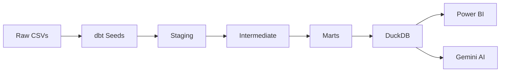
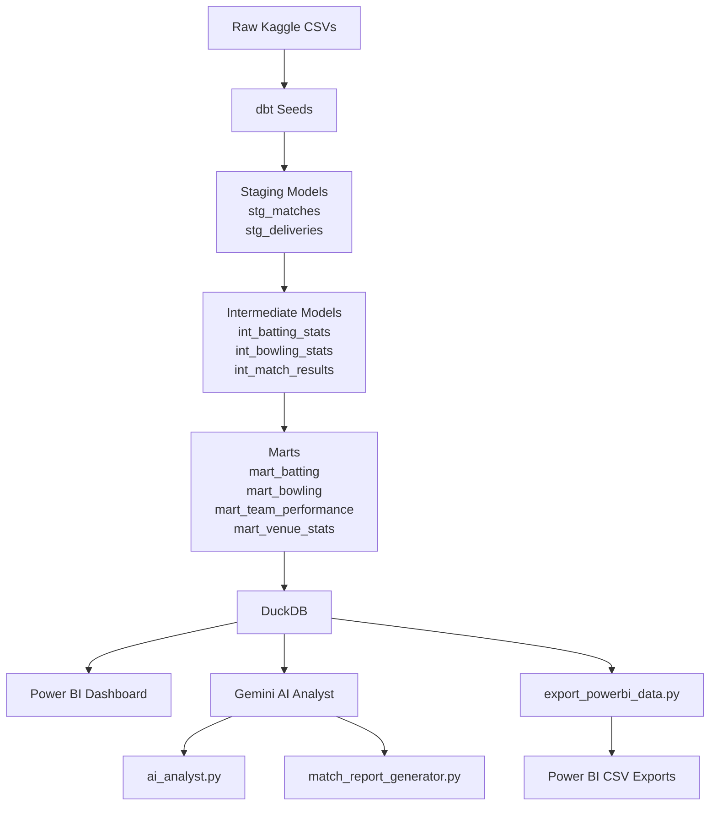
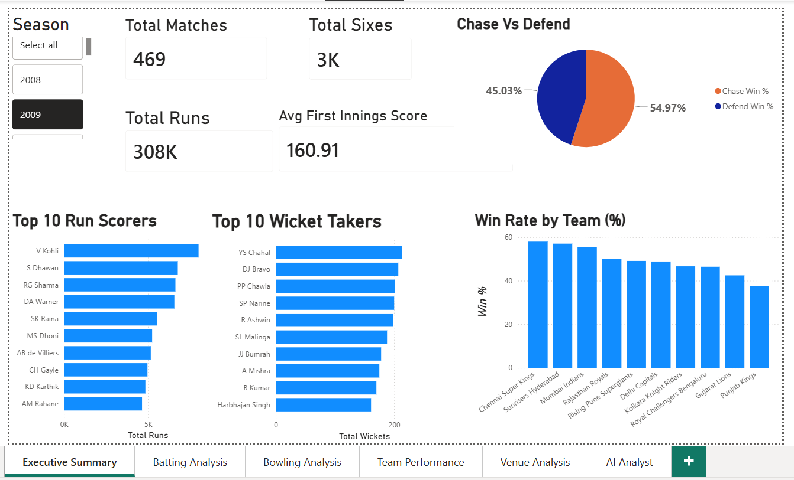
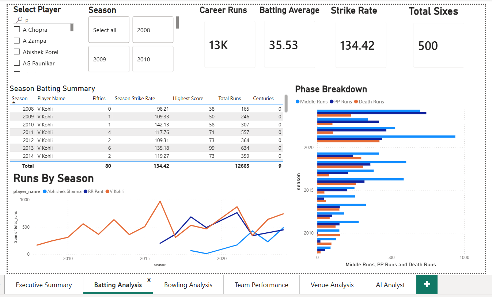
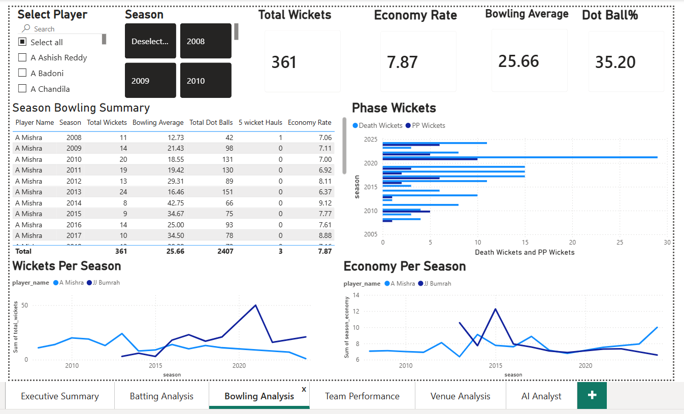
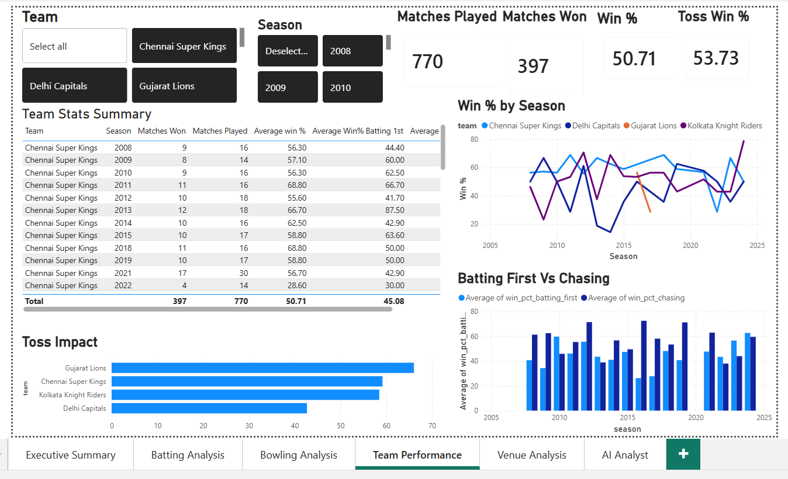
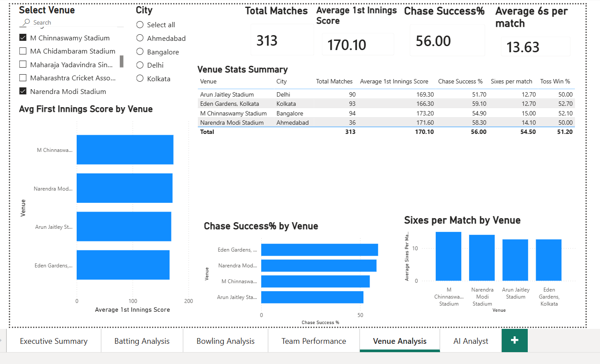
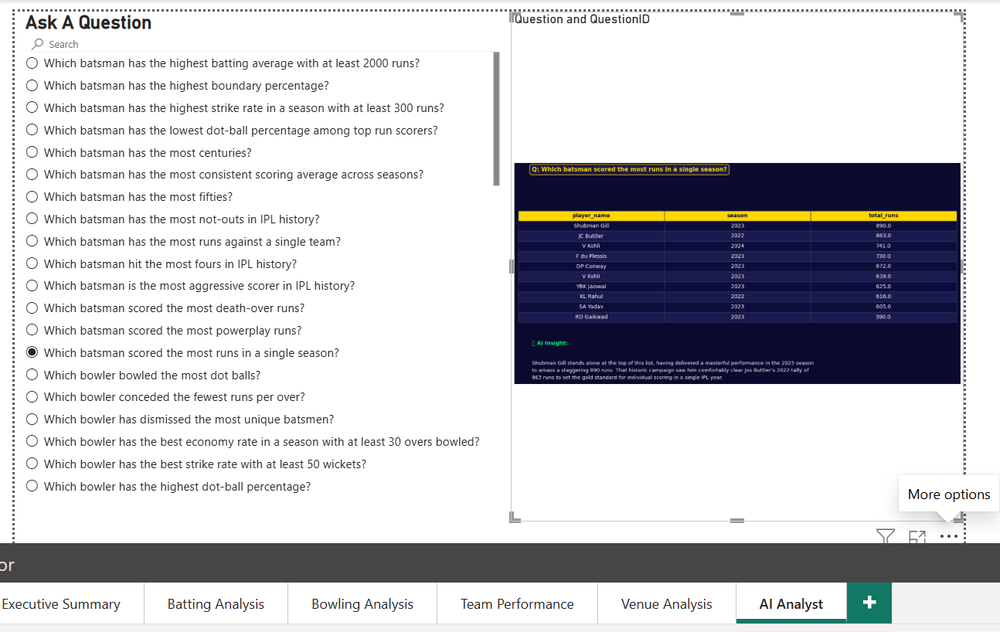

# 🏏 IPL Analytics — End-to-End Data + AI Portfolio Project

> A production-grade analytics pipeline built on real IPL data (2008–2024)  
> combining **dbt**, **DuckDB**, **Gemini AI**, and **Power BI** into one unified product.

---

## 🎯 What This Project Demonstrates

| Skill | Implementation |
|---|---|
| Data Engineering | dbt Core — 9 models across staging, intermediate, mart layers |
| Data Quality | 26 automated tests — unique, not_null, relationships, accepted_values |
| SQL | Complex aggregations, window functions, phase-wise cricket metrics |
| AI Integration | Gemini API — Text-to-SQL analyst + AI match report generator |
| Data Visualization | Power BI — 6 pages, DAX measures, Python visual |
| Software Practices | Git version control, modular architecture, documented models |

---

## 🏗️ Architecture




---

## 📁 Project Structure



---

## 📊 Data Pipeline

### Staging Layer
- **stg_matches** — Cleaned match data. Fixed season formats (`2007/08` → `2008`),
  normalized 5 rebranded team names, standardized 15+ venue name variations,
  derived toss impact columns
- **stg_deliveries** — Ball-by-ball data. Fixed 0-based over numbering,
  cleaned NA strings, added phase classification (Powerplay/Middle/Death),
  derived boundary and dot ball flags

### Intermediate Layer
- **int_batting_stats** — Per batter per innings aggregates with phase-wise breakdown
- **int_bowling_stats** — Per bowler per innings with economy, wickets, phase analysis
- **int_match_results** — Full match context joining metadata with innings totals,
  chase success classification, toss impact analysis

### Mart Layer (Power BI connects here)
- **mart_batting** — Season-level batting stats: averages, strike rates,
  milestones (100s/50s/ducks), phase runs
- **mart_bowling** — Season-level bowling stats: economy, wickets,
  five-wicket hauls, death over specialists
- **mart_team_performance** — Win %, toss conversion, batting first vs
  chasing split per team per season
- **mart_venue_stats** — Scoring patterns, chase success %, sixes per match
  per ground

---

## 🤖 AI Features

### 1. Text-to-SQL Cricket Analyst
Ask questions in plain English — Gemini generates SQL,
runs it on DuckDB, and returns insights like a commentator.

You: Who is the most economical death over bowler with at least 50 overs?
AI:  Jayant Yadav emerges as the most economical option, maintaining an
impressive death-over economy of 44.0. Spinners like Yadav and Narine
have successfully leveraged accuracy to stifle scoring in the final stages.

Features self-healing error correction — if generated SQL fails,
the AI automatically diagnoses and fixes it.

### 2. AI Match Report Generator
Automatically generates 2-sentence match summaries for every game
and stores them back in DuckDB as `mart_match_reports`.

Match 1426312 (2024) — Kolkata Knight Riders
Mitchell Starc's clinical opening spell decimated the Sunrisers for a
meager 113, setting the stage for a comprehensive demolition at Chepauk.
The Knight Riders chased down the target with ease, securing a dominant
8-wicket victory to cap off a masterclass in the 2024 season.

---

## 📈 Power BI Dashboard (6 Pages)

| Page | Content |
|---|---|
| Executive Summary | Season KPIs, top scorers/wicket takers, win rates, chase vs defend |
| Batting Analysis | Player deep dive — phase runs, form tracker, season summary |
| Bowling Analysis | Economy trends, phase wickets, bowling summary table |
| Team Performance | Win % over seasons, toss impact, batting first vs chasing split |
| Venue Analysis | Scoring patterns, chase success %, six-hitting grounds |
| AI Analyst | Live Gemini-powered Q&A — select a question, get instant insight |

---

## 🔑 Key Insights Discovered

- **54% of IPL matches are won by chasing** — pitches consistently 
  favour batting second
- **Chepauk (Chennai) has only 35% chase success** — the most 
  defend-friendly pitch in IPL
- **SRH 2024 had 3 of the top 5 highest IPL scores ever** — 
  an unprecedented batting season
- **Gujarat Titans lead chase win rate (68.5%)** in the last 3 seasons
- **Andre Russell has the highest career strike rate (164+)** 
  among batsmen with 1000+ runs

---

## 🛠️ Tech Stack

| Tool | Version | Purpose |
|---|---|---|
| dbt Core | 1.10.x | Data transformation + testing |
| DuckDB | 1.x | Local analytical database |
| Python | 3.9+ | Pipeline scripts + AI integration |
| Gemini API | 2.0 Flash | Text-to-SQL + match commentary |
| Power BI Desktop | June 2026 | Dashboard + Python visual |
| Git | — | Version control |

---

## 🚀 How to Run

```bash
# 1. Clone and setup
git clone <your-repo-url>
cd ipl_analytics
python -m venv venv
venv\Scripts\activate
pip install dbt-duckdb google-genai matplotlib pandas

# 2. Load data
cd ipl_dbt
dbt seed

# 3. Run pipeline
dbt run

# 4. Test data quality
dbt test

# 5. Generate docs
dbt docs generate && dbt docs serve

# 6. Run AI analyst
cd ..
python ai_analyst.py

# 7. Export for Power BI
python export_powerbi_data.py
```

---

## 📸 Screenshots








---

## 👤 Author

**Devender Kataria**  
Analytics Engineer | dbt · Power BI · SQL · AI Integration  
📧 [devender20025090@gmail.com]  
🔗 [https://www.linkedin.com/in/devender-kataria-a2516b1b9/]  
💼 [https://devender-portfolio-mauve.vercel.app/]